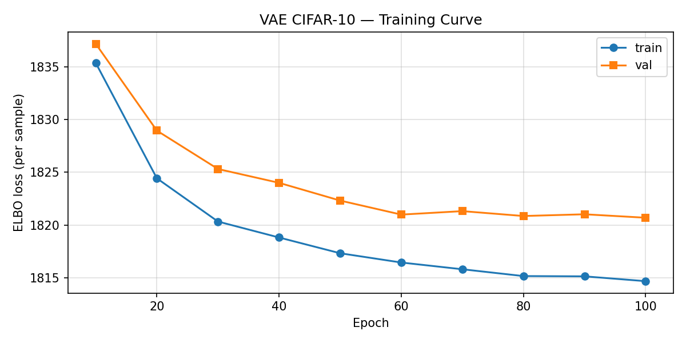
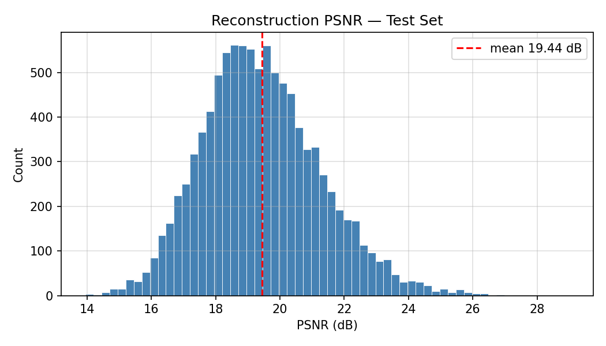
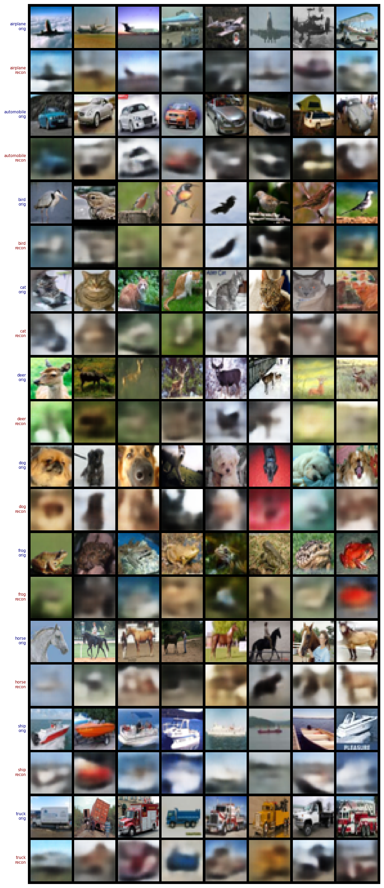
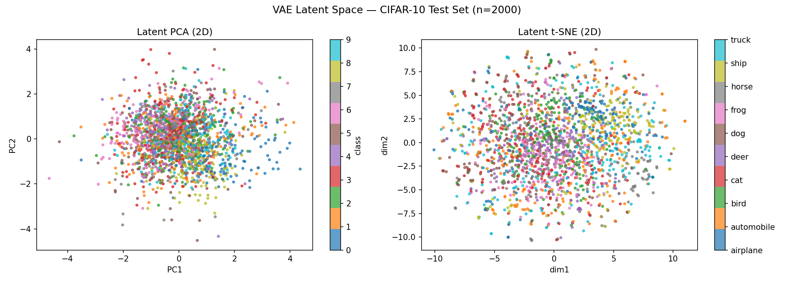

# VAE on CIFAR-10

Convolutional Variational Autoencoder trained on CIFAR-10 (32×32 RGB), implemented in PyTorch with Apple Silicon MPS support.

## Architecture

```
Encoder
  Conv2d 3→32  (4×4, stride 2)  → 16×16
  Conv2d 32→64 (4×4, stride 2)  →  8×8
  Conv2d 64→128(4×4, stride 2)  →  4×4
  Conv2d 128→256(4×4, stride 2) →  2×2
  FC → μ (128-d), log σ² (128-d)

Decoder (mirror)
  FC 128 → 256×2×2
  ConvTranspose2d ×4
  Sigmoid → 32×32×3
```

**Latent dim:** 128 | **Loss:** BCE reconstruction + KL divergence

## Results (100 epochs)

| Metric | Value |
|--------|-------|
| ELBO (test) | 1820.67 |
| Recon Loss (test) | 1777.65 |
| KL Divergence (test) | 43.01 |
| **PSNR (test)** | **19.44 dB** |

### Training curve


### PSNR distribution


### Class-wise reconstruction (original / reconstructed)


### Latent space (PCA & t-SNE, n=2000)


**Hardest classes:** deer (1903), bird (1863) — complex textures & backgrounds  
**Easiest classes:** automobile (1766), truck (1774) — clean shapes

## Setup

```bash
# Apple Silicon (arm64)
arch -arm64 python3 -m venv venv
arch -arm64 venv/bin/pip install -r requirements.txt
```

> **macOS SSL fix** — if CIFAR-10 download fails with `CERTIFICATE_VERIFY_FAILED`, the script patches SSL automatically via `certifi`. No manual action needed.

## Usage

**Train**
```bash
arch -arm64 venv/bin/python vae_cifar10.py
```

Checkpoints and sample images are saved to `outputs/` every 10 epochs.

| File | Description |
|------|-------------|
| `outputs/checkpoint_epochXXX.pt` | model + optimizer state |
| `outputs/recon_epochXXX.png` | original vs reconstructed (top/bottom rows) |
| `outputs/sample_epochXXX.png` | random samples from prior |

**Analyze**
```bash
arch -arm64 venv/bin/python analyze_vae.py
```

Saves plots to `outputs/analysis/`.

## Hyperparameters

| Parameter | Value |
|-----------|-------|
| Latent dim | 128 |
| Batch size | 256 |
| Epochs | 100 |
| Learning rate | 1e-3 (Adam) |
| Checkpoint interval | every 10 epochs |

## Hardware

Tested on Apple M5 with MPS backend. Falls back to CUDA or CPU automatically.
